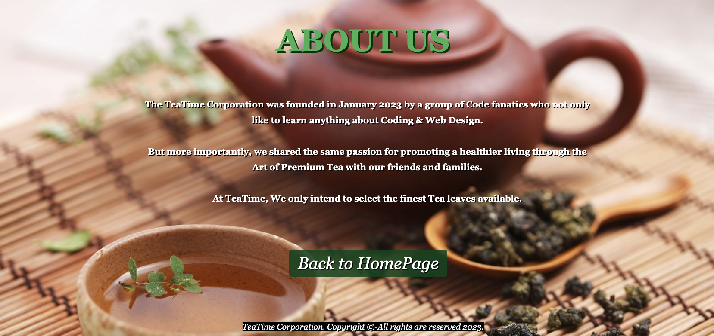

# Tea Time
 A Full-Stack Ecommerce Tea application that utilizes React, Redux, MongoDB, Nodejs, ExpressJS and JWT Authentication with PayPal as well as Stripe payment system.
 Our mission at Tea Time is to create a simplified E-commerce platform that intends to capture the growing market size of the tea industry. By offering our clients premium loose leaf tea products made from the finest leaves available we intend to stand out from our competitors.

<hr>

  [](https://github.com/ivoveloso/TeaTimez)
  [](https://github.com/ivoveloso/TeaTimez)
  [](https://github.com/ivoveloso/TeaTimez)
  [](https://choosealicense.com/licenses/mit/)
  [](https://nodejs.org/en/)
  [](https://www.npmjs.com/package/inquirer)

  ## Table of Content
  * [ Project Links ](#Project-Links)
  * [ Screenshots-Demo ](#Screenshots-Demo)
  * [ Project Objective ](#Project-Objective)
  * [ User Story ](#User-Story)
  * [ Technologies ](#Technologies)
  * [ Installation ](#Installation)
  * [ Usage ](#Usage)
  * [ Credits and Reference ](#Credits-and-Reference)
  * [ Tests ](#Tests)
  * [ Author Contact ](#Author-Contact)
  * [ License ](#License)
  #

  ##  Project Links
   ##### Deployed Link on Heroku: https://guarded-sands-84019.herokuapp.com/
  ##### GitHub Repo link: https://github.com/ivoveloso/TeaTimez

  ## Screenshots-Demo
  <kbd></kbd>
  <kbd></kbd>
  <kbd></kbd>
  <kbd></kbd>
  <kbd></kbd>
  ## Project Objective
  * In this Project, we intend to build an online E-commerce platform for commercialisation of premium Tea in promotion of a healthy Lifestyle. 
  * To apply our existing knowledge & our joint understanding on the concepts of MERN, React in application of our Business logic. 

  ## User Story
 * As a User, I want to be able to Browse available premium Tea offerings from around the world from the comfort of my own home. (Simplified T2 Operational Structure) 
 * As a User, I want to be able to select to save my favorite types of Tea in collection and come back to consider my purchase. 
 * As a User, I want to be able to sign in as a VIP user to make purchases. 
 * As a User, I want to be able to order my product from the online Platform with my preferred delivery address. 
 

  ## Technologies 
  ```
  React, MongoDB, Node.Js & Express.Js, MongooseODM, Heroku, JWT.
  
  ```
  ## Author Contact
  Contact the authors with any questions!<br>
  Github link: [ivoveloso](https://github.com/ivoveloso)<br>
  Github link: [Zac0088](https://github.com/Zac0088)<br>
  Github link: [CindzaJ](https://github.com/CindzaJ)<br>
  Github link: [DancingSandwich](https://github.com/DancingSandwich)<br>
  ## License
  This project is [MIT](https://choosealicense.com/licenses/mit/) licensed.<br />

  <hr>
  <p align='center'><i>
  Tea Time
</i></p>